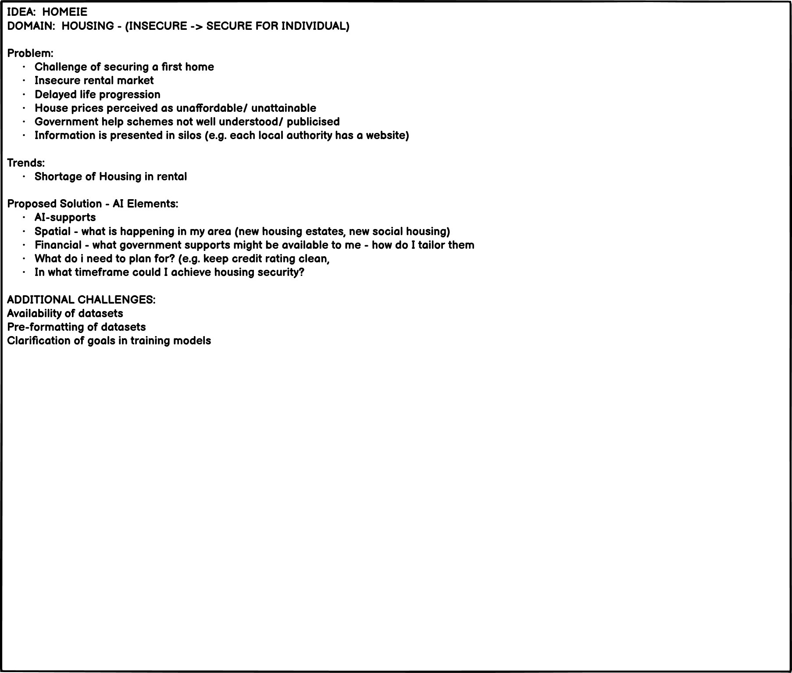
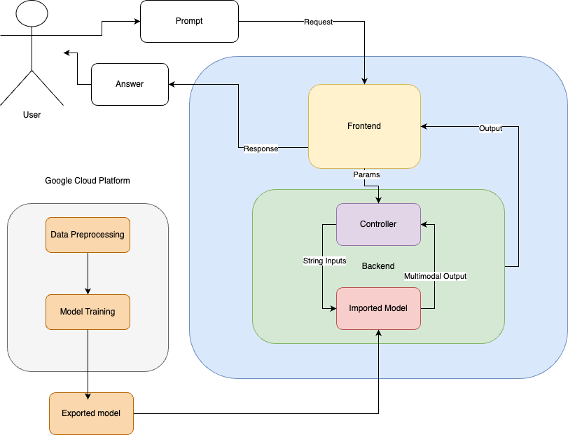

python3 -m venv <env_name>
source <env_name>/bin/activate

git clone git@github.com:vinnieOrdobas/ci_national_ai.git

pip install -r requirements.txt

<h1>HomeIE - the AI Assistant that helps you to find a secure home</h1>

<h2><em>Introduction</em><h2>

<h3><b>-What the project hopes to accomplish.</b></h3>
 

 The project aspires to identify a problem impacting modern society and offer a solution with a site that alleviates that problem.

<b>Problem Identification</b>
The pain point that we have identified is the lack of consolidated information/assistance available online for people who want to buy a secure home.  
 

 

<b>Proposed Solution</b>
The medium to solve the identified problem is to develop a web application with an interactive form and chatbot. Using Gemini, Chat GPT 4.0, we scraped a large amount of datasets to allow the AI to offer informed advice to the users of the site. It combines a number of different data sources to offer users a service that takes into account the financial situation of the user and proposes a number of different paths for them to take in order to secure a home. Specifically, we will consider grants that may be available to the user. 
 

 

 <b>Implementation</b>

 Considering the time constraints, varying experience/skillset of the team, varying ability, we assigned a Scrum Master and followed the Agile methodology. We set up a Kanban board, several shared excel files, a google drive and a page on slack. We agreed to have at least one stand-up each day, tasks would be divided and assigned on the Kanban board and we would discuss sprints/epics etc. We  conducted a lot of research and incorporated a number of different datasets to ensure that we guaranteed accuracy and to avoid the AI Chatbot from predicting hallucinations.

 We considered the demonstration of the final product from the get-go and considered the following:
-Effectiveness: how effective is the project in providing accurate and relevant advice to the user?
-Innovation: how inventive is it in approach? Noted there are other housing/rental information resources (Daft.ie, Home.ie, RTB, MABs), but we endeavour to combine a number of different sources and to make relevant information readily accessible to users
-Practical utility:  we used a large varIety of datasets to ensure the AI would not hallucinate. We planned thoroughly, the Chatbot will break down complex language and explain it in a simple manner to the user
-Functionality: The application should be functional and operational and demonstrate it's capabilities through a live demo.
-Creativity and originality: We endeavoured to produce a creative and original project
-Technical implementation: By delegating tasks, assigning tasks based on the skillset of the team member, we ensured that the project was technically sound. We ensured to make efficient use of the resources provided (Chat GPT/Gemini/Slack). We set up a host coding page and all other individuals would push requests to the main page. We set up a reviewing/approval mechanism to ensure code was double-checked and accurate. We had a number of stand-ups, shares ideas on slack, created wireframes and system architecture diagrams to solidfy the idea prior to delegating tasks.

ITEMS FOR CONSIDERATION:
How novel, creative, and original is the solution?
Does it bring a fresh perspective or approach to solving a problem?

Innovation & Creativity
How novel, creative, and original is the solution?
Does it bring a fresh perspective or approach to solving a problem?
10%
Relevance to Theme
How well does the solution align with the theme "AI ...here for Good"?
Does it contribute positively to society?
10%
Impact & Usefulness
What is the potential impact of the solution?
How effectively does it address a real-world problem?
Does it have clear benefits to users or society?
15%
Ethical Use of AI
How well does the solution adhere to ethical AI principles?
Does it prioritise fairness, transparency, privacy, and accountability?
20%
Technical Implementation
How well is the solution executed technically? Is the AI appropriately applied?
Does the demo demonstrate solid technical skills and use of the provided tools?
15%
Feasibility & Scalability
Is the solution realistic and feasible?
Can it be scaled or adapted for broader use?
Is there a clear path for further development or implementation?
20%
User Experience (UX) & Design
How intuitive and user-friendly is the solution?
Does the design enhance the overall experience?
Is the interface clear and accessible?
5%
Presentation & Pitch
How well did the team communicate their idea and solution? Was the pitch clear, concise, and engaging? Did the presentation highlight the key aspects of the project?
5%

When scoring the "Ethical Use of AI" criterion, you should consider the following:
1. Fairness & Bias Mitigation:
○ Does the AI solution avoid perpetuating biases in data, algorithms, or outcomes?
○ Has the team taken steps to identify and mitigate potential biases in their AI
models?
○ Are there mechanisms in place to ensure that the solution is fair and equitable for
all users?
2. Transparency & Explainability:
○ Is the AI system's decision-making process transparent and explainable?
○ Can users understand how decisions are made by the AI, and are these
explanations accessible and comprehensible to non-experts?
○ Has the team provided clear documentation or insights into how their AI model
works?
Collaborate with mentors and organisers on the AI Challenge Slack Channel
3. Privacy & Data Protection:
○ How well does the solution protect user data and ensure privacy?
○ Has the team implemented robust data protection measures to prevent
unauthorised access or misuse of data?
○ Does the solution comply with relevant data protection regulations and
standards?
4. Accountability & Responsibility:
○ Who is responsible for the AI’s actions, and how is accountability maintained?
○ Does the solution have mechanisms for monitoring, auditing, and correcting
errors or unintended consequences?
○ Has the team considered the ethical implications of their AI’s deployment and its
potential long-term effects?
5. Social & Environmental Responsibility:
○ Does the AI solution promote social good and avoid harm?
○ Has the team considered the environmental impact of their solution, such as
energy consumption or sustainability?
○ Are there clear benefits to society, and does the solution align with broader
ethical standards and values?
6. Inclusivity & Accessibility:
○ Is the solution designed to be inclusive and accessible to a diverse range of users, including those with disabilities? 
○ Has the team considered how their AI might impact marginalised or underrepresented groups?
○ Are there efforts to ensure that AI benefits a broad and diverse audience?
 

 

 <b>National AI Strategy</b>
 
 
How does the project align with the National AI Strategy?

 
Strands
This Strategy sets out how Ireland can be an international leader in using AI to benefit our economy and society, through a people-centred, ethical approach to its development, adoption and use.
In recognition of the wide-ranging effect AI will have on our lives, this Strategy considers AI from a number of perspectives. 
These are:
<b>Building public trust</b>
Strand 1: AI and society

Strand 2: A governance ecosystem that promotes trustworthy AI

<b>Leveraging AI for economic and societal benefit</b>
Strand 3: Driving adoption of AI in Irish enterprise
Strand 4: AI serving the public
<b>Enablers for AI</b>
Strand 5: A strong AI innovation ecosystem
Strand 6: AI education, skills and talent
Strand 7: A supportive and secure infrastructure for AI
Strand 8: Implementing the Strategy

A theme that runs through the entire Strategy is Government’s commitment to an ethical approach to AI and to the secure use of AI and other digital technologies.

-We ensured not to incluse PPI, proptected GDPR and included a disclaimer

Ultimately the ambition of this Strategy is to make sure that AI is here for good.

 
 

<h3><b>Who the project is targeting?</b></h3>

Irish residents looking for advice on securing a home with their options presented to them in an easy to understand way.

<h3><b>How it will be useful to a target audience.</b></h3>

It will enable them to make well-informed decisions about their path to securing a home. It will offer tailored advice based on comprehensive resarch and the information they have provided.

<h2><b>FEATURES:</b></h2>

oroug
<h3><b>EXISTING FEATURES</b></h3>

<h4>1.</h4>
<ol>
<li>
<h5><b>Feature: </b></h5>

</li>
<li>
<h5><b>Feature: </b></h5>
The value the feature provides: 
What it aims to achieve:  
Response testing: 
</li>
<li>
<h5><b>Feature: </b></h5>
The value the feature provides: 
What it aims to achieve: 
Response to testing: 
</li>
<li>
<h5><b>Feature: </b></h5>
The value the feature provides: 
What it aims to achieve: 
Response to testing: 
</li>
<li>
<h5><b>Feature: </b></h5>
The value the feature provides: 
What it aims to achieve: 
Response to testing: 
</li>
</ol>
<h4>2. </h4>
<ol>
<li>
<h5><b>Feature: </b></h5>
The value the feature provides: 
What it aims to achieve: 
Response to testing: 
</li>
<li>
<h5><b>Feature:</b></h5>
The value the feature provides: 
What it aims to achieve: 
Response to testing: 
</li>
<li>Feature: 
The value the feature provides: 
What it aims to achieve: 
Response to testing: 
</li>
<h5><b>3.</b></h5>
<ol>
<li>
Feature: 
The value the feature provides:
Response to testing: 
</li>
<li>
Feature: 
The value the feature provided: 
What it aims to achieve: 
Response to testing: 
</li>
<li>
Feature: 
The value the feature provided: 
What it aims to achieve: 
Response to testing:
</li>
<li>
Feature: 
The value the feature provided:
What it aims to achieve: 
Response to testing: 
</li>
<li>
Feature: 
The value the feature provides: 
What it aims to achieve: 
Response to testing: 
</li>
<li>
Feature: 
The value the feature provides: 
What it aims to achieve:  
Response to testing: 
</li>
<li>
Feature: 
The value the feature provides: 
What it aims to achieve: 
Response to testing: 
</li>
</ol>

<h3><b>FEATURES LEFT TO IMPLEMENT (Future Features) - scope for future development</b></h3>

 

 <ol>
 <li></li>
 <li></li>
 <li></li>
 <li> </li>
 <li></li>
 <li></li>
 </ol>
 

 <h2>TESTING</h2>

 We have conducted enough testing to legitimately believe that the site works well, as outlined in the various types of testing below: Manual testing, Lighthouse testing using developer tools, viewing the website on different browsers both manually and online and validator testing using online validation websites W3C and Jigsaw. 
 
  Also, as noted in the features section above, We have also manually tested all of the project's features and ensured that they operated as intended, outlining the response in each of the features sections.

 We tested the website in a variety of ways to ensure full functionality. This included manual testing (e.g. testing each feature and ensuring that it could complete what it was in place to complete) Additionally, we interacted with developer tools and the lighthouse function to see the code/make updates and to test different viewports. We manually checked the viewports on my phone and laptop also to ensure that the website was fully responsive, as intended. We also tested the website on different viewports online.

   We used different tools to perform the validation testing on the code, as outlined below. We used W3C to test HTML and W3C Jigsaw to test CSS.

 <h3>Manual Testing of the responsiveness of the website:</h3>
 1. To different viewports
  Once deployed, we opened the opened the website on various viewports to test responsiveness. 
    I applied flex to these elements and retested per below:
   
  <b>Responsiveness testing:</b>
                       
  <table>
                <caption><b>Testing for responsiveness</b></caption>
                <tr>
                    <th><b>Iphone 12 pro</b</th>
                    <th><b>Macbook Pro</b></th>
                    <th><b>Ipad Air</b></th>
                    <th><b>Nest Hub</b></th>
                </tr>
                <tr>
                    <td>Site is responsive<=700px</td>
                </tr>
                <tr>
                    <td>Yes</td>
                    <td>Yes</td>
                    <td>Yes</td>
                    <td>Yes</td>
                </tr>
                <tr>
                    <td>Links/URLs:</td>
                </tr>
                <tr>
                    <td>Yes</td>
                    <td>Yes</td>
                    <td>Yes</td>
                    <td>Yes</td>
                </tr>
                <tr>
                    <td>Images work:</td>
                </tr>
                <tr>
                    <td>Yes</td>
                    <td>Yes</td>
                    <td>Yes</td>
                    <td>Yes</td>
                </tr>
                <tr>
            </table> 

 
Screengrabs of different tests:

 Iphone 12 pro: 

 MacBook Pro: 

 Ipad Air: 

 Nest Hub:  

 2. To different browsers

 I opened the website on my laptop and it worked accordingly

 Browsers: Safari, Google Chrome, Internet Explorer, Firefox

  <table>
                <caption><b>Browser compatibility:</b></caption>
                <tr>
                    <th>Chrome</th>
                    <th>Firefox</th>
                    <th>Safari</th>
                    <th>Internet Explorer</th>
                </tr>
                <tr>
                    <td>Intended responsiveness:</td>
                </tr>
                <tr>
                    <td>Yes</td>
                    <td>Yes</td>
                    <td>Yes</td>
                    <td>Yes</td>
                </tr>
                <tr>
                    <td>Intended functionality:</td>
                </tr>
                <tr>
                    <td>Yes</td>
                    <td>Yes</td>
                    <td>Yes</td>
                    <td>Yes</td>
                </tr>
            </table>   

VALIDATOR TESTING:
Interesting bugs and problems discovered whilst testing:

  <h3>Addressed bugs and problems:</h3>
  <li>
  </li> 
  <h3>Unaddressed bugs and problems</h3>
  <li>
  </li>
  <li>
  </li>

Bugs:

1. What was the problem?: 
What was the solution?: 

2. What was the problem?: 
What was the solution?: 

3. What was the problem?: 
What was the solution?: 

4. What was the problem?: 
What was the solution?: 

<h2>LIGHTHOUSE</h2>
We accessed the 'LIGHTHOUSE' testing tool via Developer Tools. Please see a screengrab of the successful lIGHTHOUSE testing below. we believe all %s are adequate:

we redid the 'LIGHTHOUSE' validation after adjusting the website to correct all of the HTML and CSS errors and still achieved adequate % as per below screengrab:

Please see details on the manual testing of all of the website (HTML first, followed by CSS)

<h3>The testing of <b>HTML</b> was completed on the W3C Validator.</h3>

In order to test each page, I copied the HTML code directly from GITHUB and pasted it into the direct input window on the validator, per the below:

Per the screengrabs included, I manually pasted in the HTML of each individual page and amended each of the errors as I progressed. Please see the results for each page below (divided out by error), including my responses to each issue:

<h2><b>HTML:</b></h2>
  <h3>1.</h3>
  <ol>
  <li> 
  

  

  
Description of error:

  
Response to error:

  </li>
  <li>
  

  
Screengrab of error:

  
Description of error: 

  
Response to error: 

  </li>
  <li>

Screengrab of error:

  
Description of error:

  
Response to error:

  </li>
  <li>
  

  
Screengrab of error:

  
Description of error:

  
Response to error:

  </li>
  <li>
  

  
Screengrab of error:

  
Description of error:

  
Response to error:

  </li>
  <li>
   

   
Screengrab of error:

  
Description of error:

  
Response to error:

  </li>
  <li>
  

  
Screengrab of error:

  
Description of error:

  
Response to error:

  </li>
  <li>
  

  
Screengrab of error:

  
Description of error:

  
Response to error:

  </li>
  <li>
  

  
Screengrab of error:

  
Description of error:

  
Response to error:

  </li>
  <li>
  

  
Screengrab of error:

  
>Description of error:

  
Response to error:

  </li>
  <li>
  

  
Screengrab of error:

  
Description of error:

  
Response to error:

  </li>
  <li>
  

  
Screengrab of error:

  
Description of error:

   
Response to error:

  </li>
  <li>
  

  
Screengrab of error:

  
Description of error:

  
Response to error:

  </li>
  <li>
  

  
Screengrab of error:

  
Description of error:

  
Response to error:

  </li>
  <li>
  

  
Screengrab of error:

  
Description of error:

  
Response to error:

  </li>
  <li>
  

  
Screengrab of error:

  
Description of error:

  
Response to error:

  </li>
  <li>
  

  
Screengrab of error:

  
Description of error:

  
Response to error:

  </li>
  </ol>

 

  <h3>2.</h3>
  <ol>
  <li>
    

    
Screengrab of error:

  
Description of error:

  
Response to error:

  </li>
  <li>
   

    
Screengrab of error:

  

  
Response to error:

  </li>
  <li>
   

    
Screengrab of error:

  
Description of error:

  
Response to error: 

  </li>
  <li>
   

  
Screengrab of error:

  
Description of error:

  
Response to error:

  </li>
  <li>
   
Screengrab of error:

  
Description of error:

  
Response to error:

  </li>
  <li>
   

  
Screengrab of error:

  
Description of error: 

  
Response to error:

  </li>
  <li>
   

   
Screengrab of error:

;

  
Description of error:

  
Response to error:

  </li>
  <li>
  

  
Screengrab of error:

   
Description of error:

  
Response to error:

  </li>
  <li>
   

   
Screengrab of error:

   
Description of error:

  
Response to error:

  </li>
  <li>
  

  
Screengrab of error:

   
Description of error:

  
Response to error:

  </li>
  <li>
   

   
Screengrab of error:

  
Description of error:

  
Response to error:

  </li>
  <li>
   

   
Screengrab of error:

  
Description of error:

  
Response to error:

  </li>
  <li>
  

  
Screengrab of error:

  
Description of error:

  
Response to error:

  </li>
  </ol>
  

No further errors message: 

  <h3>3. </h3>
  <ol>
   <li>
  

  
Description of error:

  
Response to error:

   </li>
  <li>
   

  
Screengrab of error:

  
Description of error:

  
Response to error:

  </li>
  <li>
   

  
Screengrab of error:

   
Description of error:

  
Response to error:

<li>
 

 
Screengrab of error:

 
Description of error:

 
Response to error:

  </li>
  <li>
  

  
Screengrab of error:

  
Description of error:

  
Response to error:

  </li>
  <li>
  

  
Screengrab of error:

  
Description of error:

  
Response to error:

  </li>
  <li>
   

  
Screengrab of error:

  
Description of error:

  
Response to error:

  </li>
  <li>
  </ol>
  

  No further errors message:

  
  

  <section>
  

  

  </section>

  <b>CSS:</b>

  <h3>The testing of CSS was completed on the JIGSAW Validator.</h3>

 
Please see the W3C Jigsaw validator below:

:

 
Response to error:

Redid the validation testing and no errors:

  <b>UNFIXED BUGS</b>
   
  <ul>
  <li>
  </li>
  <li>
  </li>
  <li>
  </li>
  </ul>
   
   <b>DEPLOYMENT PROCESS</b>

   The site was deployed to GitHub pages. I took the following steps to deploy the site (please see relevant screengrabs that further illustrate the process also):
<ol>
   <li>In the relevant GitHub repositary, we navigated to the Settings tab.</li>

  <b>Repository:</b> 

  <b>Settings:</b>

   <li>From the source section drop-down menu, I selected the Master Branch.</li>

   <b>Main branch selection:</b>

   <li>Once the Master branch was selected, the page automatically refreshed with a detailed ribbon display to indicate the successful deployment.</li>

   <b>Live website published:</b>

</ol>
   As then specified on GITHUB, the <em>live link</em> can be found here:

   

   <b>CREDITS:</b>

   

   <b>CONTENT & MEDIA SOURCES:</b>
   <ul>
   <li></li>
   <li></li>
   <li></li>
   <li></li>
   <li></li>
   <li></li>
   <li></li>
   <li></li>
   <li></li>
   <li></li>
   <li></li>
   </ul>

<h2>User Experience:</h2>

<b>Brainstorm:& Research</b>

Our team brainstormed this idea by thinking about what type of website/platform/app would be ideal for the solution we have in mind. Please see wireframes below

We also discussed the architecture of the project - how we would compile/combine all elements as well as integrate the AI. We designed the following point of reference for the architecture of the project:

Data centres...relevance...impact on society..ethics

We believe that the site is very user friendly, it is responsive and interactive, clearly laid out and accessible as it contains alts and aria-labels for screen readers.

We considered the five planes of user experience when designing the website:

Strategy Plane, Scope Plane, Structure Plane, Skeleton Plane and the Surface Plane.

Please see how these were considered:

1. Strategy Plane: 

When deciding on what features to include, we compared viability and feasibility (whether the team had the skills, resources and time to implement the desired features) to Importance (business goals and user needs). Deciding on what to keep and not to keep.

The business goals with the website included:

  -Create online presence-leveraging from other resources (RTB/Daft.ie/MyHome.ie/CSO)
  -Make resource available to potential home buyers
  -Link in with various data sources
  -Offer caveats that mortgage may not be offered and prices may changes
  -Link several data sources
  -AI: Gemini and ChatGPT
  -Stacked agents

2. Scope Plane:

When considering the scope plane, we focussed on what to include to satisfy all of the user needs.
We applied an agile approach to building the website-with a Kanban board, user stories, assigned tasks, daily stand-ups and sprints.
The wireframes and stand-ups assisted to create focus and to develop realistic expectations. 
We decided on the features on extensive huddles on slack, which provided clarity, with the tasks seeming manageable and controllable.

 As per the Hackathon Guidance, we believe that the project is very scaleable and thus have included detail on future features that could be developed upon.

 We adjusted the sprints etc to suit the compressed timeline of the Hackathon.

 Due to time pressure, there was a danger of scope creep (adding random new features too late) so we actively avoided this considering what items were must have, should have and could have.

 When distinguishing what features to add, we considered:

 -What users need
 -What they actually need
 -What they don't know they need

 In terms of content requirements, we included mixed content with images, video and animations and everything included was useful, sellable and buildable.

 We also considered the project from a commercial stand-point. We considered the below four questions in relation to business rules:
1. Objective-2. Functional-3. Non-functional-4. Business rules

 1. Objective-what does user want to accomplish?
 2. Functional-What does user need to do to accomplish objective?
 3. Non-functional-What contraints does the website have?
 4. Scaleable: As the user base grows, can the application handle the growth in traffic?

 User story-how user interacts with system

 <b>User Stories planned for site:</b>

 As a team, we brainstormed some user stories when thinking about how to build the project. 

  We created a shared excel file and input user stories for considerations, under the following headings:

  User Story-Expected Answer Format-Expected answer (if exact)-Datasets we would like

3. Structure Plane:

The structure plane is concerned with the organisation of functionality and content. Navigating through in a functional way.

 How is the information presented?

 The information is presented in an organised and intuitive way.

<b>Interaction Design</b>

The interaction design is the structure and behavior of the interactive systems within the website (e.g. Form, Chatbot etc.)

We ensured the following when designing the website:
<ul>
<li>Site is consistent, predictable , visible and clear</li>
<li>Interactive features are consistent in colouring, the combination of XX and XX is used throughout the website as these were listed as the most popular colours of newly built homes. 
</li>
<li>Scenario:</li>
<li>Consistency of terms, content and imagery have a stable and consistent style. The font used throughout is XX and I aimed to keep the tone consistent</li>
</ul>

4. Skeleton Plane:

The skeleton plane is concerned with the navigation design and interface design.
The two main things to consider, are what form the application will take in terms of design and how users will get around what is presented.

The goals are:
-Give form to function
-Establish value in the users mind
-Leads user toward continuing experience as they will be inspired to revisit the website
-Value is added with each click; taking user feedback, providing information and creating links with other platforms (Daft.ie/MABs/Home.ie)
-Add positivity to overall experience with each interaction

Progressive disclosure-reveal information across space...

navigation-different tabs used (Does it start with form etc.)

Visually group information in order of importance. The form must be completed prior to the user interacting with the Chatbot as the Chatbot will use the information input in the form to inform the answers they provide 

We considered the Hick-Hyman Law, that if the user is presented with too many options, it will take them longer to reach a decision so we aspied to keep the design clear and uniform 

Good information design should be invisible, only bad design is noticeable.

I tried to make the website easy to navigate, with relevant, different information on each making for good information design. 

Too much information is worse then no information so we endeavoured to ensure that the information conveyed was as concise as possible. 

The context and order of the presentation of information was considered.

We ensured that the overall website was clean, minimal and effective

<h4>Use of Wireframes in relation to Skeleton Plane</h4>

These are 2D models of what finished product will be which should be completed at the research phase. As referenced earlier, we used Balsamiq to create the wireframe, a simplified, stripped down version of what we wanted my website to be.

It worked as a starting point and helped us to decide on the form, information architecture and arrangement.

It allowed us to see the overall balance of elements and structure and to decide on what gets included and how it's organised. The wireframes helped the develop the strategy and goals of the website and to investigate whether the relationships work and does the project make sense. 

5. Surface Plane:

The surface plane is a visual language that provides information and context. It provides colour, layout, fonts, images, order, sequence and the site's identity.

It is also concerned with economy- important elements should be easily recognised. We applied this with italics and boldings as well as heading size and the structure of the sections.

We considered progressive disclosure, and as the user moves through website, more granuler information is disclosed.

We also considered color contrast between foreground and background. We used the colour combination of purple on white throughout as it was simple but stark and offered adequate contrast so as to ensure that all of the text was legible  and consistent.

We used the font of XX as we researched font online and it was recommended as highly legible no matter what font size.

<h4>Points of Improvement going forward</h4>

Scraping websites...process...After a while discovered Chat GPT 4.0 was very effective
AI - becoming more adept

