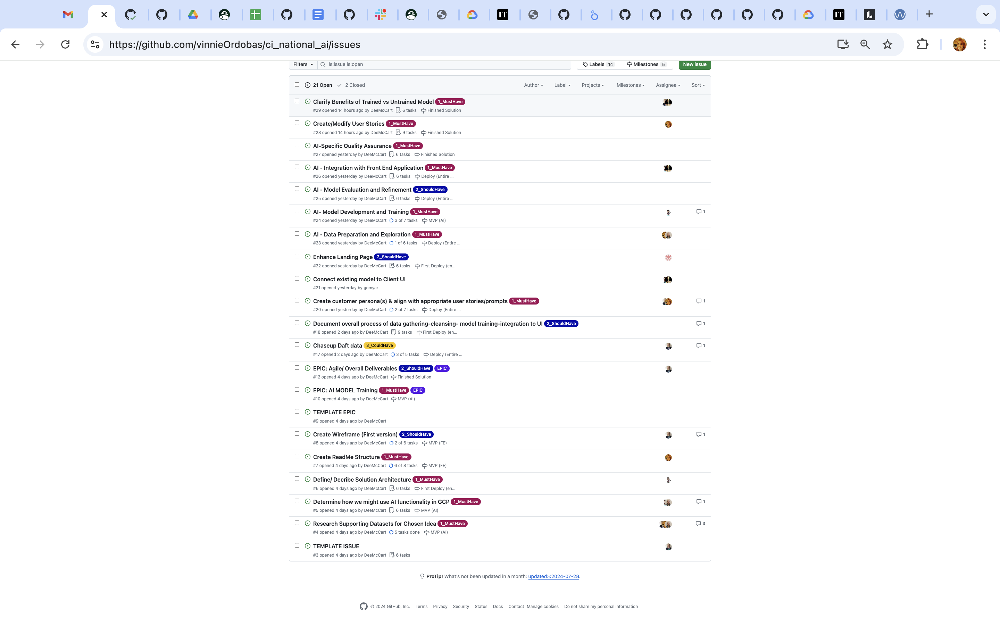
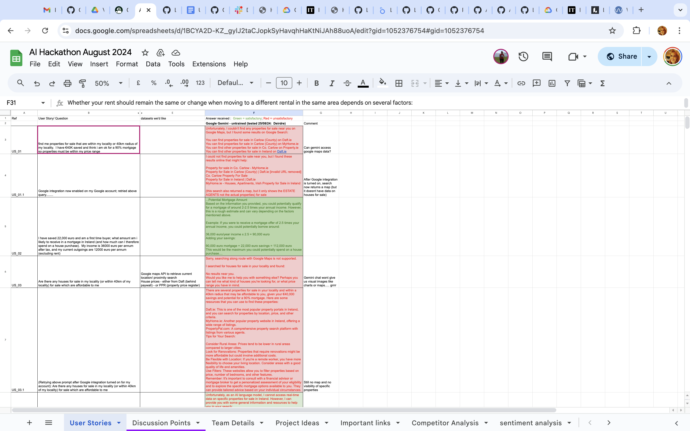

[CI logo](https://codeinstitute.s3.amazonaws.com/fullstack/ci_logo_small.png)

# HomeIE - the AI Assistant that helps you to find a secure home

## *Introduction*

### **-What the project hopes to accomplish.**

The project aims to identify a problem affecting modern society and to provide an AI-driven solution through a website designed to address that problem.

**Problem Identification**  
The pain point we have identified is the lack of easily accessible, comprehensive information and assistance available online for people looking to securely purchase a home. The solutions are often buried deep within dense documents, hidden in hyperlinks in small print on webpage footers. Moreover, the information is scattered across unconnected websites, creating a tedious obstacle course for users.

**Proposed Solution**  
Our solution, ‘Homie,’ consolidates all relevant information in a fun and engaging way through an accessible chatbot interface. We address this problem by developing a web application featuring an interactive form and chatbot. Using Chat GPT-4.0, integrated with Gemini, we responsibly sourced extensive datasets to empower the AI with the ability to offer informed and personalized advice. This service draws on a variety of data sources to consider the user’s financial situation and suggests multiple paths to homeownership or rental, including the identification of potential grants and financial assistance programs.

**Implementation**

Given the time constraints and the varying experience levels within our team, we assigned a Scrum Master and adhered to the Agile methodology. We utilized a Kanban board for task management, shared Excel files and Google Drive for collaboration, and Slack for communication. Daily stand-ups were held to ensure alignment, and tasks were carefully divided and assigned based on skillsets.

From the outset, we focused on ensuring the effectiveness, innovation, and practical utility of our solution. We incorporated diverse datasets to enhance accuracy and reduce the risk of AI hallucinations, ensuring that our chatbot delivers clear and reliable advice. Functionality was prioritized, with the application designed to be fully operational for a live demo.

Creativity and originality were central to our approach, and we implemented a rigorous technical process. By setting up a host coding page, establishing a review mechanism, and using wireframes and system architecture diagrams, we ensured that our project was technically sound and well-coordinated.

**Process for setting up a collaborative environment on Github (Step-by-step process):**

- Main branch
- Push and pull requests
- From scratch (VSCode)
- Creating a fresh branch on each commit and push (discuss importance of this)

**Description of our team, skillset and main contribution to the project:** *(Ask each member to add their own description)*

- **Deirdre** - Scrum Master, spearheaded the Kanban Board and Agile approach. Arranged and chaired most huddles, delegated tasks and performed testing on the model.
- **Sean** - Gathering relevant datasets, scraping data from relevant websites, and trained pipeline for custom jobs.
- **Vinnie** - Trained pipeline for custom job, performed supervised fine-tuning of the model.
- **Berat** - Trained pipeline for custom job.
- **Valerie** - Gathered datasets, created README.
- **Ray** - CI Employee, offers his expertise in resolving logic issues and developed the client UI/deployed the project.
- **Stefan** - CI Employee, assisted with building the pipeline and front-end design.

### Hackathon Specific Criteria:
1. **Innovation & Creativity**

   Our solution stands out by consolidating all relevant information into a single platform, unlike Daft.ie, Home.ie, MABs, or Citizens Information, which offer fragmented resources. ‘Homie’ serves as an interactive guide, making the information more accessible and user-friendly.

   We leveraged Chat GPT 4.0 to significantly reduce time by transforming data from various formats into conversational Q&A JSONL files with context. This allowed us to compile a comprehensive dataset for training, despite the model’s limitations in retraining. This also ensured mitigation of AI bias.

   - Creative methodologies used by the team
   - Design choices used by the team: TBC Ray and Stefan
   - Problem-solving strategies your team used: The team creatively utilized Chat GPT 4.0 for JSONL extraction, significantly saving time that would have otherwise been spent on data scraping.

2. **Relevance to Theme**

   The theme ‘AI …here for Good’ aligns perfectly with our solution, which uses AI to provide an easily accessible service on housing and grants. This empowers the public, helping them feel more in control when seeking a home, rather than feeling powerless.

   Our AI assistant, ‘Homie,’ transforms dense literature and overwhelming statistics, tables, charts, and graphs into easily accessible information. ‘Homie’ is trained to be knowledgeable across all relevant areas, prepared for every eventuality, and designed to minimize the risk of hallucinations by bridging logical gaps.

   We have harnessed AI to make housing information more accessible and understandable to society. Our chatbot, ‘Homie,’ is equipped with an extensive and varied knowledge base, enabling it to draw connections so users don’t have to.

3. **Impact & Usefulness**

   The potential impact of this web application on society is substantial. In Ireland, it is all too common for individuals to be swindled out of deposits, deceived by unscrupulous landlords, or left without a home or refuge. Our web application is designed to serve all segments of society, offering tailored advice to marginalized groups such as the previously homeless, refugees and asylum seekers fleeing war-torn countries, and the elderly seeking assistive living arrangements.

   When prompted, the AI chatbot provides extensive, tailored information that addresses the unique circumstances of each user, ensuring that they receive the most relevant and accurate advice.

4. **Ethical Use of AI**

   Ethical AI principles: fairness, transparency, privacy, and accountability throughout the design and implementation of our AI solution.

   Homie adheres to these ethical AI principles by ensuring fairness in decision-making processes, allowing users to interact with the web application at their discretion, without being guided or coerced into sharing Personally Identifiable Information (PPI). The AI maintains transparency through clear disclaimers outlining its limitations, which are included at the bottom of each tab. Additionally, we prioritize user privacy by implementing robust data handling practices—Homie does not retain any information, and no PPI is collected or shared by the user.

   To ensure data was handled ethically with respect to user privacy and consent, users are required to expressly state their consent where applicable. They are fully informed of any limitations through the disclaimers provided. Furthermore, if continuing with the web application, we would maintain accountability by regularly reviewing and auditing our AI processes to ensure they align with these ethical standards.

   **Ask team about user consent, user clicking agreement/pop-ups...research AI processes**

5. **Technical Implementation**

   As kindly made available to us by TechIreland, we used GCP, OpenAI, Chat GPT 4.0, and Gemini to create the web application.

   - Chat GPT - Dataset scraping and reformatting of files 
   - GCP -
   - Gemini - 
   - Framework - Flask
   -Limitations of GPU

   - Technical difficulty = need to create a pipeline so different datasets could be added in same instance, model cannot be retrained, had to consolidate data into one file

6. **Feasibility & Scalability**

   - **Realistic Approach**: Discuss the practicality of your solution, including any potential challenges in implementation.
     Homie is a very practical solution to a very real, omnipresent issue in modern Ireland. Gone are the days when only wealthy people could access technology—the modern world is the Digital Age. Even someone with very limited resources could access the web application in a public library.

     It will have a simple and well-navigated layout to increase user understanding.

   - **Scalability**: The project has immense potential to be scaled. It is very effective with a limited amount of datasets put in...could be expanded to include a housing permission form, to create a tailored lease to offer a landlord, a rental/house buying checklist tailored to the area the person wants to buy...

7. **User Experience (UX) & Design**

   **to ask Stefan and Ray**

   - Design Principles: Describe the design choices made to enhance UX. Highlight any user testing or feedback that influenced the design.
   - Accessibility: Screen readers...can AI read responses? Easy to navigate...

8. **Presentation & Pitch**

   - **What It Means**: This criterion evaluates how well your team communicates the idea and solution. It looks at the clarity, conciseness, and engagement of your pitch.
   - **How to Address It**:
     - Clear Communication: Ensure your pitch is clear and focused on key aspects of the project. Avoid technical jargon unless necessary and explain concepts simply.
     - Engagement: Make the presentation engaging by using visuals, real-world examples, and a compelling narrative.

   - Real world examples = Need for housing advice, Irish Times article on immigration

### Ethical Use of AI:

1. **Fairness & Bias Mitigation:**
   - **Bias Mitigation:** Our project, “Homie,” is designed to provide housing advice tailored to individual needs while actively avoiding biases in data and decision-making. We ensured that the datasets used were diverse and representative of various social groups, including marginalized communities, to prevent the perpetuation of existing biases.
   - **Fairness Mechanisms:** We implemented fairness checks in our AI models to detect and address any potential biases. These checks help to ensure that “HomeIE” provides equitable recommendations regardless of the user’s background or situation.

2. **Transparency & Explainability:**
   - **Transparency:** We prioritized transparency in “Homie” by including clear, user-friendly explanations of how the AI generates its recommendations. Each interaction with the chatbot is accompanied by an explanation of the data sources and reasoning behind the advice given.
   - **Documentation:** Our team provided comprehensive documentation that outlines the workings of the AI model, making it accessible to both technical and non-technical users. This ensures that users understand the process behind “Homie’s” decision-making.

3. **Privacy & Data Protection:**
   - **Data Protection:** “Homie” was built with user privacy as a top priority. The chatbot does not retain any Personally Identifiable Information (PPI), and all user interactions are anonymized to protect privacy.
   - **Compliance:** Our project complies with data protection regulations, ensuring that any data handled is done so securely and in accordance with relevant standards. We also implemented encryption and other security measures to prevent unauthorized access.

4. **Accountability & Responsibility:**
   - **Accountability Measures:** We established clear accountability by implementing logging and auditing mechanisms that track “Homie’s” interactions and decisions. This allows us to monitor for any errors or unintended consequences and correct them as needed.
   - **Ethical Considerations:** Our team carefully considered the ethical implications of deploying “Homie,” particularly in terms of its impact on users’ decisions regarding housing. We are committed to ongoing monitoring and updates to ensure responsible use.

5. **Social & Environmental Responsibility:**
   - **Social Good:** “Homie” is designed to promote social good by making critical housing information accessible to all, including marginalized and vulnerable groups. This contributes to a more equitable society by empowering users to make informed decisions about their housing options.
   - **Environmental Responsibility:** While the primary focus of our project is on social impact, we have also considered the environmental footprint of our solution. We optimized the AI’s operations to minimize energy consumption and maximize efficiency.

6. **Inclusivity & Accessibility:**
   - **Inclusive Design:** “Homie” was developed with inclusivity in mind, offering accessible interfaces and easy-to-understand language to ensure it can be used by people from all walks of life, including those with disabilities.
   - **Marginalized Groups:** Our team specifically tailored “Homie’s” advice to address the needs of marginalized groups, such as refugees, the elderly, and low-income individuals, ensuring that they receive relevant and actionable information.

### National AI Strategy

**How does the project align with the National AI Strategy?**

This Strategy sets out how Ireland can be an international leader in using AI to benefit our economy and society, through a people-centred, ethical approach to its development, adoption and use.

In recognition of the wide-ranging effect AI will have on our lives, this Strategy considers AI from a number of perspectives. These are:

#### **Building public trust**

- **Strand 1: AI and society**  
  Our project directly addresses critical societal issues by providing accessible housing advice through AI, thereby impacting society at its foundation. Housing is a fundamental need, and without it, all other areas of society suffer. Our AI-driven solution supports marginalized groups, including those facing homelessness, immigrants seeking refuge from war-torn regions, and vulnerable populations in need of secure housing. By partnering with organizations like the Peter McVerry Trust, we ensure that our application offers tailored advice to various subsets of society, thereby reinforcing social stability and trust in AI solutions.

- **Strand 2: A governance ecosystem that promotes trustworthy AI**  
  We have ensured that our AI system is trustworthy by implementing rigorous measures to prevent AI hallucinations, including thorough research and validation of data sources. Data privacy is paramount in our application; personal information is not retained, and all data is erased once the chatbot session ends, in full compliance with GDPR regulations. These steps contribute to a governance ecosystem that users can trust, knowing that their interactions are secure and their privacy is protected.

#### **Leveraging AI for economic and societal benefit**

- **Strand 3: Driving adoption of AI in Irish enterprise**  
  By providing a user-friendly AI application that consolidates housing information, our project encourages the adoption of AI in everyday life and supports the broader digital transformation of Irish enterprises. By reducing barriers to accessing crucial housing information, our solution not only serves individuals but also strengthens the ecosystem of services that support the housing market, driving economic and societal benefits across Ireland.

- **Strand 4: AI serving the public**  
  Our AI-driven solution, ‘Homie,’ exemplifies how AI can serve the public by making essential housing information accessible and understandable to all. The application is designed to provide equitable access to housing advice, thereby improving public welfare and supporting those in need.

- **Strand 5: A strong AI innovation ecosystem**  
  Our project contributes to a robust AI innovation ecosystem by integrating cutting-edge AI technologies like GPT-4, fostering innovation, and demonstrating practical applications of AI in solving real-world problems.

- **Strand 6: AI education, skills and talent**  
  The development of our project has been a collaborative effort, enhancing the skills and talent of our team in AI development. By sharing our approach and insights, we aim to contribute to the growing body of knowledge in AI and inspire future projects.

- **Strand 7: A supportive and secure infrastructure for AI**  
  We have built our solution on a secure infrastructure that prioritizes user data protection and compliance with legal standards, ensuring that our AI application operates within a safe and reliable framework.

- **Strand 8: Implementing the Strategy**  
  Our project aligns with the ambitions of the National AI Strategy by demonstrating a commitment to ethical AI practices, contributing to societal good, and reinforcing the secure and responsible use of AI technologies.

### **Who the project is targeting?**

The project is targeting Irish residents who are seeking clear, accessible advice on securing a home. This includes a wide range of individuals, from first-time homebuyers to those facing challenges such as financial constraints or limited knowledge of the housing market.

### **How it will be useful to a target audience.**

The project will empower users to make well-informed decisions about securing a home by offering tailored advice that takes into account their unique circumstances. This advice is based on comprehensive research and the specific information they provide. What sets our solution apart is its ability to draw from a wide range of reliable sources, ensuring that users receive the most accurate and relevant guidance available.

<b>Technical Details:</b>

**Berat to complete this section?
The technology stack used
Any significant libraries used
Frameworks used: Flask
APIs, and the reasoning behind these choices.
Training 
Environment set-up, dependencies

<b>User instructions</b>
User Instructions:
Installation and Setup: Provide clear step-by-step instructions on how to set up the project locally. This should include environment setup, dependencies, and how to run the application.
Usage Guide: Add a brief guide on how users can interact with the AI assistant, including sample questions or scenarios to help them understand how to use the tool effectively.

Planning - Description of subscription, making Github collaborative, choosing the project and why (what else was considered), step by step of User stories, Agile, Data gathering, Model Training, Supervized fine tuning, creating a training pipeline for a custom job with Vertex AI

<b>Brainstorm:& Research</b>

Our team brainstormed this idea by thinking about what type of web application would be ideal for the solution we have in mind. Please see wireframes below:t

We also discussed the architecture of the project - how we would compile/combine all elements as well as integrate the AI. We designed the following point of reference for the architecture of the project:

Next after extensive planning meetings, we elected Deirdre as Scrum Master and she set up a detailed KanBan Board.:

### Data Considerations for Model Fine-Tuning with Vertex AI

When determining the data to gather for fine-tuning our model using Vertex AI, we evaluated several fine-tuning methods:

**Supervised Fine-Tuning:**  
This approach involves using a dataset where each example includes both an input (such as text or an image) and a corresponding desired output (such as a classification label or a generated text response). Supervised fine-tuning is particularly suited for tasks such as classification, summarization, reasoning, and question-answering.

**Reinforcement Learning from Human Feedback (RLHF):**  
This method involves fine-tuning the model based on human feedback to adjust the tone and style of the model's responses. An example of this process is when models like ChatGPT present multiple responses and ask users to rate them. While this technique can be valuable for refining the model's output style, we have determined that it is not necessary for our current objectives.

**Model Distillation:**  
Model distillation is typically employed to transfer the knowledge from a larger model to a smaller one, creating a more lightweight version suitable for deployment on devices with limited resources, such as Android. However, this method is not relevant to our current needs and will not be utilized.

### Data Considerations for Supervised Learning

Given that our training will focus on supervised learning tasks, it is crucial to carefully curate the dataset. The data must be structured effectively, particularly in a question-and-answer format, to ensure that the model performs optimally in the targeted applications.

We recognized the need for data that could be formatted in a conversational question/answer format to facilitate supervised fine-tuning.

### Technical Implementation and Pipeline Development

**Pipeline Development:**
Vinnie outlined the process for creating a test pipeline, which involves containerizing the application and deploying it to Google Cloud Platform (GCP). The goal is to validate the end-to-end process before scaling up to more complex tasks. This involves gathering and formatting datasets, uploading them to the GCP Console UI, and creating a comprehensive training pipeline. Given the computational demands of training a large language model (LLM), the process will require significant GPU resources.

**Pipeline Steps:**

1. **Define the Pipeline:**
   - **Objective:** Set up a simple test pipeline to validate the process.
   - **Components:**
     - Data preprocessing
     - A simple training loop (e.g., training a small model on a small dataset)
     - Evaluation and logging

2. **Containerize the Pipeline:**
   - **Step 1: Write a Dockerfile**
     - **Objective:** Containerize the pipeline for deployment on GCP.
   - **Step 2: Build and Test the Docker Image**
     - **Commands to run:**
       - `docker build -t my-pipeline .`
       - `docker run my-pipeline`
       - `gcloud auth login`
     - **Tag and push the Docker image:**

3. **Deploy the Container to GCP:**
   - **Step 1: Push the Docker Image to Google Container Registry (GCR)**
     - Login to GCP and use the command line to push the image.
   - **Step 2: Deploy to Google Cloud Run or GKE**
     - **For Google Cloud Run:**
     - **For Google Kubernetes Engine (GKE):**
       - Create a GKE cluster and deploy the container.

4. **Test and Monitor the Pipeline on GCP:**
   - **Step 1: Monitor the Deployment**
     - Use the GCP Console to monitor logs, performance, and resource usage.
     - Verify that the pipeline runs as expected and outputs the desired results.

5. **Scaling Up: Training the LLM**
   - **Step 1: Preparing for Full-Scale Training**
     - **Objective:** Once the test pipeline is successful, scale up by preparing the full dataset and utilizing GPUs.
     - **Tasks:**
       - Data Preparation: Format and preprocess datasets as needed.
       - Upload to GCP: Upload datasets to Google Cloud Storage (GCS).
       - Adjust Pipeline for LLM: Modify the pipeline to train the larger model using the full dataset.
       - GPU Resources: Ensure that the GCP environment is configured with GPUs (e.g., using GKE with GPU nodes or AI Platform).

   - **Step 2: Train the LLM**
     - **Initiate the Training:** Start the training process on the full-scale model using AI Platform’s training services or by running the job on GKE with GPU support.

### Dataset Preparation and Optimization

In the context of time and resource constraints, we capped the dataset size at 100k rows to balance efficiency and training time. This required distilling the datasets based on user stories and required capabilities, ensuring we retained underlying patterns while reducing dataset size. This approach aims to achieve over 90% efficiency while optimizing for time.

### ChatGPT-Assisted Scraping and Dataset Preparation

We leveraged ChatGPT to streamline the scraping and dataset preparation process. Key advantages included:
- **Pro vs Mini:** Understanding the limitations and benefits of the Pro version, such as direct file uploads and downloads, which were crucial for data conversion tasks.
- **Efficiency:** By uploading datasets directly to ChatGPT, we reduced the time required for data processing. Continuous chat functionality allowed for more nuanced and context-aware interactions.
- **Error Monitoring:** We closely monitored ChatGPT for any mistakes and adjusted our prompts accordingly, highlighting the importance of precise question phrasing.

In summary, these processes set the stage for effective supervised fine-tuning of the HomeIE model, ensuring it meets the needs of the targeted user base.
## **FEATURES:**

### **EXISTING FEATURES**

1. **Interactive Chatbot Assistant**
   - **Value Provided:** The interactive chatbot serves as the primary user interface, offering personalized advice and information based on user inputs. It significantly enhances user engagement by providing immediate, tailored responses.
   - **Objective:** To provide users with accessible, accurate, and relevant housing advice based on their specific needs and inputs.
   - **Response to Testing:** Comprehensive testing was conducted, focusing on response accuracy, context understanding, and user satisfaction. Details of the testing process and results are provided in the testing section below.

2. **Form**
   - **Value Provided:** The form allows users to input specific data anonymously, which the chatbot uses to generate personalized and relevant advice. This feature enhances the accuracy and relevance of the chatbot's responses.
   - **Objective:** To gather essential user data that informs the chatbot’s responses, ensuring that advice is personalized and useful.
   - **Response to Testing:** Testing focused on data handling, anonymity, and integration with the chatbot. Results indicate that the form successfully captures user data without compromising privacy, and this data is effectively used by the chatbot.

3. **Language Abilities of the Chatbot**
   - **Value Provided:** The chatbot supports multiple languages, making the application accessible to a broader audience, including non-native English speakers.
   - **Objective:** To ensure that the chatbot can communicate effectively with users in various languages, improving accessibility and inclusivity.
   - **Response to Testing:** Language testing involved assessing the chatbot’s ability to understand and respond in different languages. The chatbot successfully handled multiple languages, but ongoing improvements are planned to enhance fluency and cultural relevance.

4. **API Integration with Looker Studio**
   - **Value Provided:** This feature enables the dynamic display of real-time housing market statistics and trends through visualizations created in Looker Studio. This adds a valuable layer of data-driven insights to the user experience.
   - **Objective:** To provide users with up-to-date visual information about the housing market, enhancing the advice given by the chatbot.
   - **Response to Testing:** Testing involved ensuring that the API correctly retrieves and displays data from Looker Studio. The integration was successful, with data being accurately represented in the visualizations.

### **FEATURES LEFT TO IMPLEMENT (Future Features)**

1. **AI-Driven Screen Narration**
   - **Objective:** To increase accessibility by enabling the AI to audibly describe on-screen content, assisting visually impaired users.
   - **Impact:** This feature will make the HomeIE application more inclusive, ensuring that all users can access the information provided by the chatbot.

2. **Video Prompts**
   - **Objective:** To enhance user engagement by providing video prompts that guide users through the process of securing a home.
   - **Impact:** Video prompts will offer a more interactive and educational experience, helping users understand complex information more easily.

3. **EIRCODE Integration**
   - **Objective:** To allow users to upload their EIRCODE, enabling the chatbot to search for housing options in that specific area.
   - **Impact:** This feature will provide more localized and relevant housing information, making the advice even more personalized.

4. **Photo Upload Capability**
   - **Objective:** To allow users to upload photos that the chatbot can analyze to provide advice on housing conditions or potential improvements.
   - **Impact:** This feature will add a visual analysis component to the chatbot’s capabilities, offering more comprehensive advice.

## TESTING

We have conducted extensive testing to ensure that the web application has reached an acceptable level of functionality. The various types of testing conducted are outlined below:

### Manual Testing
We performed comprehensive manual testing on all features of the application to ensure they functioned as intended. This included testing each feature to verify that it could complete its designated tasks. Additionally, we manually tested the website on different devices, including phones and laptops, to ensure full responsiveness and functionality across various viewports.

### Lighthouse Testing Using Developer Tools
Lighthouse testing was conducted using developer tools to assess the website's performance, accessibility, best practices, and SEO. We viewed the website on different browsers, both manually and online, to ensure a consistent and accessible experience across all platforms. Accessibility was a priority, and Lighthouse provided crucial insights that helped us refine the user experience.

### Validator Testing Using Online Validation Tools
To ensure that our code adheres to industry standards, we used the following validation tools:

- **W3C Markup Validation Service for HTML**
  - [Include a brief summary of the results here, e.g., "All HTML files passed validation with no errors."]

- **W3C CSS Validator for CSS**
  - [Include a brief summary of the results here, e.g., "All CSS files passed validation with minor warnings that were addressed."]

- **JSHint for JavaScript**
  - [Include a brief summary of the results here, e.g., "JavaScript code passed validation with minor improvements suggested for code efficiency."]

- **Pylint for Python**
  - [Include a brief summary of the results here, e.g., "Python scripts were tested and met the required coding standards, with a PEP8 compliance rate of 95%."]

- **WAVE Web Accessibility Evaluation Tool**
  - [Include a brief summary of the results here, e.g., "The accessibility audit revealed minimal issues, which were promptly corrected to ensure full compliance with accessibility standards."]

### Overall Testing Summary
In addition to the above, we manually tested all of the project's features to ensure they operated as intended. The testing process was thorough, involving various approaches to validate the functionality, responsiveness, and accessibility of the website. By interacting with developer tools and performing manual checks across different devices and viewports, we ensured that the website is fully functional and responsive.

### Additional Notes
- All testing was documented, and any issues identified were addressed promptly to maintain the highest standards of quality and functionality.
- The testing process also included peer reviews and cross-testing among team members to ensure consistency and accuracy across all features.

 ### Manual Testing of the Responsiveness of the Website

1. **Testing Across Different Viewports**
   - Once deployed, the website was opened on various viewports to test its responsiveness.

   **Responsiveness Testing:**

   | **Device**       | **Responsive (<=700px)** | **Links/URLs** | **Images Work** |
   |------------------|--------------------------|----------------|-----------------|
   | iPhone 12 Pro    | Yes                      | Yes            | Yes             |
   | MacBook Pro      | Yes                      | Yes            | Yes             |
   | iPad Air         | Yes                      | Yes            | Yes             |
   | Nest Hub         | Yes                      | Yes            | Yes             |

   **Screengrabs of Different Tests:**

   - iPhone 12 Pro: 
   - MacBook Pro: 
   - iPad Air: 
   - Nest Hub: 

2. **Testing Across Different Browsers**
   - The website was opened on various browsers to ensure compatibility and intended functionality.

   **Browser Compatibility:**

   | **Browser**          | **Responsive** | **Functionality** |
   |----------------------|----------------|-------------------|
   | Chrome               | Yes            | Yes               |
   | Firefox              | Yes            | Yes               |
   | Safari               | Yes            | Yes               |
   | Internet Explorer    | Yes            | Yes               |

### Bugs and Issues Identified During Testing

**Addressed Bugs and Problems:**
- [List of bugs/issues that were identified and fixed, e.g., "Fixed issue with image rendering on iPhone 12 Pro."]
- [Another addressed bug, e.g., "Corrected hyperlink behavior in Safari."]

**Unaddressed Bugs and Problems:**
- [List of bugs/issues that remain unresolved, e.g., "Minor CSS alignment issue on Internet Explorer."]
- [Another unaddressed bug, e.g., "Occasional slow loading times on Nest Hub."]

### Additional Notes
- Testing was conducted across various devices and browsers to ensure comprehensive coverage. Any issues discovered were documented and prioritized for resolution based on their impact on the user experience.
- Further testing will be conducted as additional features are implemented or as new devices and browsers are released.

### Bugs

1. **Problem:** [Describe the specific issue encountered]
   - **Solution:** [Explain how the issue was resolved]

2. **Problem:** [Describe the specific issue encountered]
   - **Solution:** [Explain how the issue was resolved]

3. **Problem:** [Describe the specific issue encountered]
   - **Solution:** [Explain how the issue was resolved]

4. **Problem:** [Describe the specific issue encountered]
   - **Solution:** [Explain how the issue was resolved]

### Lighthouse Testing

In alignment with the National AI Strategy, we aimed to ensure that our web application was fully accessible. To achieve this, we utilized the Lighthouse testing tool available through Developer Tools.

Below is a screengrab of the initial Lighthouse test results, which we believe demonstrate adequate performance across key metrics (Performance, Accessibility, Best Practices, SEO):

After addressing all HTML and CSS errors identified during the first round of testing, we re-ran the Lighthouse validation. The subsequent test results confirmed that the adjustments improved overall scores:

### HTML and CSS Validation

#### HTML Validation

The HTML of the website was validated using the W3C Markup Validation Service. Each page was tested by copying the HTML code directly from GitHub and pasting it into the validator’s input window. Below are screengrabs of the validation process:

- **HTML Code Input:** 
- **Validation Results:** 

For each page, I manually corrected the errors as they were identified. Below is a summary of the errors encountered and the actions taken to resolve them:

1. **Page Name: [Insert Page Name]**
   - **Error:** [Description of the error]
   - **Solution:** [Steps taken to fix the error]

2. **Page Name: [Insert Page Name]**
   - **Error:** [Description of the error]
   - **Solution:** [Steps taken to fix the error]

#### CSS Validation

The CSS of the website was validated using the W3C CSS Validator. Each stylesheet was tested to ensure compliance with CSS standards. Below are screengrabs of the validation process and results:

- **CSS Validation Input:** 
- **Validation Results:** 

### Deployment Process

The site was successfully deployed to GitHub Pages. The following steps outline the deployment process:

1. **Repository Selection:**
   - Navigate to the relevant GitHub repository and go to the Settings tab.
   - 

2. **Branch Selection:**
   - From the source section drop-down menu, select the `Master` branch (or `Main` branch depending on the repository setup).
   - 

3. **Deployment Confirmation:**
   - Once the branch is selected, the page will refresh, and a ribbon display will indicate that the deployment was successful.
   - 

The live link to the deployed website can be found [here](link_to_live_site).

### User Experience

We believe that HomeIE offers an intuitive, responsive, and accessible user experience. The application is designed to be interactive and user-friendly, with a clear layout and consistent appearance. Key accessibility features, such as `alt` text and `aria-labels`, ensure that the website is usable for individuals relying on screen readers.

We incorporated the five planes of user experience in the design of HomeIE:

1. **Strategy Plane:** Defined the objectives of the website, focusing on providing accessible housing advice.
2. **Scope Plane:** Determined the functionalities required to meet user needs, such as the chatbot and API integrations.
3. **Structure Plane:** Organized the content and features in a logical and user-friendly manner.
4. **Skeleton Plane:** Developed wireframes and mockups to visualize the layout and navigation.
5. **Surface Plane:** Applied visual design principles to ensure the website is aesthetically pleasing and consistent.

### Collaboration Tools

Throughout the project, we used various collaboration tools to streamline development:

- **GitHub:** Managed version control, pull requests, and code reviews.
- **Slack:** Facilitated communication and coordination among team members.
- **Virtual Machines and APIs:** Used for testing and integration with external data sources. Below are screengrabs of these processes:

### 1. Strategy Plane

When deciding on what features to include, we compared viability and feasibility (whether the team had the skills, resources, and time to implement the desired features) against importance (alignment with business goals and user needs). The core element of this plane is making strategic decisions about what features and elements to include or exclude, ensuring that the project remains focused and achievable.

The business goals for the website are categorized as follows:

**Internal Objectives:**

- Create an online presence by leveraging resources such as RTB, Daft.ie, MyHome.ie, and CSO.
- Link in with various data sources to provide comprehensive and up-to-date information.
- Link several data sources to ensure data consistency and reliability.
- Incorporate AI technologies like Gemini and ChatGPT to demonstrate that AI is a beneficial tool.
- Utilize stacked agents to optimize system performance and capability.

**User-Centric Goals:**

- Make resources available to potential home buyers, providing them with valuable information and tools.
- Offer caveats that mortgages may not be offered, and prices may change, ensuring transparency and managing user expectations.

### 2. Scope Plane:

When considering the scope plane, we focused on what to include to satisfy all of the user needs. We applied an agile approach to building HomeIE—with a Kanban board, user stories, assigned tasks, daily stand-ups, and sprints. The wireframes and stand-ups helped create focus and develop realistic expectations. We decided on the features through extensive huddles on Slack, which provided clarity, with the tasks seeming manageable and controllable.

As per the Hackathon Guidance, we believe that the project is very scalable and thus have included details on future features that could be developed upon.

We adjusted the sprints, etc., to suit the compressed timeline of the Hackathon.

Due to time pressure, there was a danger of scope creep (adding random new features too late), so we actively avoided this by employing the MOSCOW prioritization technique; considering what items were **must have**, **should have**, and **could have**.

When distinguishing what features to add, we considered:

- What users need.
- What they actually need.
- What they don't know they need.

In terms of content requirements, we included mixed content with images, *video*, and *animations*, ensuring that everything included was useful, sellable, and buildable.

*Adjust to content of the end product, will we have a form, will we have video/animations/live data.*

We also evaluated the project from a commercial perspective, focusing on four key aspects of business rules:

1. **Objective**: What does the user want to accomplish? The user wants to find tailored advice on how to secure a home (based on their personal situation). They want to consider all angles. The platform meets this objective by leveraging data and AI to provide personalized, relevant insights, making the advice more actionable and precise.
2. **Functional**: What does the user need to do to achieve that objective? The user needs to fill out a form with key details. This will be linked with the interactive AI Chatbot, which will offer tailored prompts based on the queries that the user sends to it. The user experience is designed to be intuitive and user-friendly, ensuring that users can easily navigate the process to receive the advice they need.
3. **Non-functional**: What constraints does the website have? It is currently working with static data, and GPU limitations and the tight timeframe limited the size of the datasets we could train the model with. In the future, we plan to explore dynamic data integration and potential infrastructure upgrades to overcome these current limitations and enhance the system’s capabilities.
4. **Scalability**: As the user base grows, can the application handle increased traffic? Yes, no PPI is stored for each user. Additionally, the application’s backend is designed to scale with the user base, utilizing cloud services and modular architecture to handle increased traffic efficiently. This ensures that as the platform grows, it can maintain performance and reliability.

**User Stories Planned for HomeIE:**

As a team, we brainstormed some user stories when thinking about how to build the project.

We created a shared Excel file and input user stories for consideration under the following headings:

Sample of user stories:
<table>
    <caption><b>User Stories Planned for HomeIE</b></caption>
    <tr>
        <th><b>User Story</b></th>
        <th><b>Expected Answer Format</b></th>
        <th><b>Expected Answer (if exact)</b></th>
        <th><b>Datasets</b></th>
    </tr>
    <tr>
        <td>As a first-time homebuyer, I want advice on mortgage options available to me based on my income and savings.</td>
        <td>Text response with a list of mortgage options</td>
        <td>"You are eligible for the Help to Buy scheme and a first-time buyer mortgage with X Bank."</td>
        <td>RTB, Daft.ie, CSO mortgage datasets</td>
    </tr>
    <tr>
        <td>As a user, I want to find properties in my price range in Dublin.</td>
        <td>List of properties with brief details (price, location)</td>
        <td>N/A</td>
        <td>Daft.ie, MyHome.ie property listings</td>
    </tr>
    <tr>
        <td>As a potential buyer, I want to know the average property prices in my desired area over the past year.</td>
        <td>Text or graph showing price trends</td>
        <td>"The average property price in Dublin 8 was €350,000 over the past year."</td>
        <td>CSO, Property Price Register (PPR)</td>
    </tr>
    <tr>
        <td>As a renter, I want to understand the potential rental yield of a property based on current market trends.</td>
        <td>Percentage or text-based explanation</td>
        <td>"The estimated rental yield for this property is 5%."</td>
        <td>Daft.ie, MyHome.ie rental listings and trends</td>
    </tr>
</table>

 ### 3. Structure Plane:

The structure plane is concerned with the organization of functionality and content, ensuring that users can navigate the website effectively and intuitively.

**Information Presentation**

The information on "HomeIE" is presented in a structured and intuitive manner, with a clear hierarchy that guides users through the site. Content is organized logically, prioritizing the most relevant information for potential homebuyers. For example, property search results are prominently displayed, and key resources are accessible from the main navigation.

**Interaction Design**

The interaction design of "HomeIE" focuses on creating a seamless and engaging experience for users as they interact with the website’s features, such as forms and the AI-powered chatbot. These interactive elements are designed to be consistent, predictable, and user-friendly.

We ensured the following when designing the website:

- **Consistency and Clarity**: The site’s design maintains a consistent and predictable layout throughout, with clear labeling and instructions for all interactive elements. This ensures that users can easily understand how to use the site.
- **Color and Font Choices**: The interactive features, including forms and buttons, use a consistent color scheme of [Color 1] and [Color 2], which were selected based on their popularity in modern home designs and their ability to provide clear visual cues. The font used across the site is [Font Name], chosen for its readability and modern aesthetic, helping to maintain a professional and welcoming tone.
- **Scenario-Based Design**: The design elements, including terminology, content, and imagery, are consistent across the site, providing a stable and familiar experience. We considered various user scenarios to ensure that the website meets the needs of all users, from first-time homebuyers to experienced investors.

These design choices were made to ensure that the overall user experience is not only functional but also enjoyable, encouraging users to return to the site as a trusted resource in their home-buying journey.

### 4. Skeleton Plane:

The skeleton plane is concerned with the navigation and interface design of the website. The primary considerations are the form that the application will take and how users will navigate through the presented content.

**Key Goals:**
- **Give form to function**: Ensure that every design element serves a clear purpose and supports the website’s overall functionality.
- **Establish value in the user’s mind**: Create a user experience that adds value with each interaction, encouraging users to return to the site.
- **Encourage continued engagement**: By making information useful and relevant, we aim to inspire users to revisit the website, recommend it to others, or return when their circumstances change. (Noting that we protect user privacy by not storing personal information/PPI).

- **Enhance user experience**: Each interaction is designed to add positivity, whether through providing valuable information, taking user feedback into account, or creating seamless links to other platforms (Daft.ie, MABS, Home.ie).

**Progressive Disclosure**: We reveal information gradually, allowing users to explore content without being overwhelmed. For example, after users fill out the initial form, they gain access to more tailored advice from the chatbot.

**Navigation Design**: The website features a simple and intuitive navigation structure with clearly labeled tabs that guide users through the process of securing a home. For instance, users start with a form that gathers essential details, which the chatbot then uses to provide personalized advice.

In designing the website, we grouped information visually based on its importance. The form must be completed before interacting with the chatbot, ensuring that the chatbot’s responses are accurate and relevant.

We considered the **Hick-Hyman Law**, which suggests that offering too many options can slow decision-making. Therefore, we kept the design clear and uniform, minimizing the number of choices presented at any given time.

Good information design is often invisible—users should feel that the site is easy to navigate without noticing the effort that went into its design. We aimed to achieve this by making the website clean, minimal, and effective, ensuring that users can find what they need quickly and easily.

**Use of Wireframes in Relation to the Skeleton Plane:**

Wireframes were essential in planning the layout and structure of the website. Created during the research phase using Balsamiq, these 2D models provided a simplified, stripped-down version of the website. They served as a starting point, helping us decide on the form, information architecture, and arrangement of elements.

Wireframes allowed us to balance the overall design, ensure the functionality of each element, and verify that the relationships between different parts of the website made sense. They were crucial in developing the strategy and goals for the website, enabling us to refine the design based on feedback and testing.

### 5. Surface Plane

The surface plane is a visual language that provides information and context. It encompasses color, layout, fonts, images, order, sequence, and the overall identity of the site.

This plane is also concerned with **economy**—ensuring that important elements are easily recognized by users. We applied this principle by using italics and bolding to highlight key information, along with carefully selected heading sizes and structured sections to guide the user's attention.

We considered **progressive disclosure**, gradually revealing more detailed information as users move through the website. For example, initial property search results provide basic details, with more in-depth information available upon further interaction.

Color contrast was a key consideration. We used a **purple on white** color scheme throughout the website as it provides a simple yet stark contrast, ensuring that all text is legible and consistent across different devices and lighting conditions.

We selected the **Roboto** font after researching its legibility across various screen sizes and resolutions. This font was chosen for its clean, modern look, which aligns with HomeIE's brand identity and enhances readability, whether the text is small or large.

**Visual Identity and Consistency**

The visual elements of HomeIE—color, font, and layout—work together to create a cohesive identity that reflects the website's purpose and values. The color scheme is both modern and approachable, aligning with our goal of making the home-buying process as straightforward as possible. The consistent use of design elements, such as spacing and typography, ensures a seamless experience as users navigate through the site.

In summary, the surface plane of HomeIE is designed to be clean, minimal, and effective, providing users with a visually pleasing and intuitive experience that supports their journey toward securing a home.

### Points of Improvement Going Forward and Scalability of the Web Application

#### Web Scraping and Data Gathering
Throughout the development process, we utilized web scraping to gather data from various sources. Initially, this process presented some challenges, but leveraging ChatGPT 4.0 significantly improved our efficiency in parsing and understanding the scraped data. Moving forward, we aim to refine this process further by integrating additional tools such as [mention specific tools] and automating more aspects of the scraping workflow to enhance accuracy and reduce manual effort.

#### Advancements in AI Capabilities
As we continue to develop HomeIE, our proficiency in utilizing AI, particularly ChatGPT, is growing. We have seen improvements in natural language processing, user intent recognition, and the overall accuracy of responses. Future enhancements will focus on deepening the AI’s contextual understanding, expanding its ability to handle more complex queries, and incorporating user feedback to continually refine the AI's performance.

#### Integration with Looker Studio
To provide users with real-time data insights, we plan to integrate Looker Studio into the HomeIE platform. This will enable us to create live, interactive graphs that visualize key housing market trends. These visualizations will be directly linked to the data gathered through our scraping efforts and will update dynamically as new information becomes available. Alternatively, we may directly link to the CSO API to ensure the most accurate and up-to-date data is presented.

#### Enhancing Chatbot Responsiveness
A key area of focus will be ensuring that the chatbot is highly responsive to the data collected through user forms. By fine-tuning the integration between form inputs and chatbot responses, we can provide users with more accurate and personalized advice. This will involve refining the algorithms that match user inputs to the appropriate AI responses and expanding the dataset used to train the chatbot to cover a broader range of scenarios.

#### Optimizing Information Input for ChatGPT
The effectiveness of ChatGPT in delivering valuable insights depends heavily on the quality and specificity of the input data it receives. We plan to optimize the way information is input into the system by developing more structured data entry formats, incorporating additional layers of data preprocessing, and introducing validation checks to ensure that the AI has the context it needs to provide precise and actionable advice.

#### Building Scalable Data Pipelines
To support the ongoing training and improvement of our AI models, we are developing a robust data pipeline system. This pipeline will allow us to seamlessly integrate new datasets as they become available, ensuring that our models remain up-to-date and scalable. By automating much of the data ingestion and processing, we can focus more on refining the AI’s performance and expanding its capabilities.

#### Implementing New AI Technology as it Becomes Available
We are actively monitoring advancements in AI technology through sources such as TDLR. Notably, a new iteration of ChatGPT, titled 'Strawberry,' is expected to be released soon with advanced math-solving and programming capabilities. This update will be particularly beneficial for HomeIE, as it will enhance the accuracy of budgeting and projection features, providing users with even more reliable financial advice.

#### Increasing Accessibility through Language
To make HomeIE more accessible, we are exploring options to include AI-driven text-to-speech functionality, allowing the website to be read aloud to users. Additionally, we aim to introduce voice command capabilities, enabling users to interact with the platform via microphone input rather than typing. We will also work on refining the chatbot’s language processing abilities to better serve users who may have limited English proficiency, ensuring that marginalized groups can fully benefit from the platform.

#### Strengthening the Relationship Between the Form and the Chatbot
We plan to enhance the synergy between the user form and the chatbot by introducing suggested prompts generated by the chatbot based on the information users input into the form. Additionally, the chatbot's responses to specific user questions will be tailored more closely to the answers provided in the form, ensuring that the advice given is highly personalized and relevant to the user’s situation.

#### Design Enhancements
As we continue to improve the visual aspects of HomeIE, we plan to introduce animations and video prompts to make the user experience more engaging and interactive. These enhancements will not only make the platform more visually appealing but also help convey complex information in a more accessible and user-friendly manner.

### **CREDITS**

### **Content & Media Sources:**

- [Central Statistics Office (CSO)](https://www.cso.ie/)
- [Homelessness in Ireland](https://homelessnessinireland.ie/)
- [Property Price Register](https://www.propertypriceregister.ie/)
- [Housing Agency - Social Housing Support Overview](https://www.housingagency.ie/housing-information/social-housing-support-overview)
- [CorkBeo Property News](https://www.corkbeo.ie/news/property/)
- [Money Advice and Budgeting Service (MABS)](https://www.mabs.ie/en/)
- [Data.gov.ie - Housing Dataset](https://data.gov.ie/dataset?theme=Housing)
- [Citizens Information](https://citizensinformation.ie)
- [Hugging Face Datasets](https://huggingface.co/datasets/)
- [YouTube Video: Housing Trends](https://www.youtube.com/watch?v=IMccv8xbguE)
- [Savills Property Search](https://www.savills.ie/find-a-property/)
- [Central Bank of Ireland](https://www.centralbank.ie/)
- [Irish Times Article on Immigration](https://www.irishtimes.com/ireland/2024/08/27/immigration-to-ireland-hits-17-year-high-as-emigration-also-rises/)
- [Android Authority Article on OpenAI Strawberry](https://www.androidauthority.com/openai-strawberry-ai-3475682/?utm_source=tldrnewslette-t)
- [Economic and Social Research Institute (ESRI) - Housing Research](https://www.esri.ie/research-areas/housing)
- [MyHome.ie](https://www.myhome.ie/)
- [Daft.ie](https://www.daft.ie/)
- [Residential Tenancies Board (RTB)](https://www.rtb.ie/)
- [Google Cloud - Vertex AI Training Pipeline Documentation](https://cloud.google.com/vertex-ai/docs/training/create-training-pipeline)

### **Acknowledgements**

- **TechIreland**: For organizing this wonderful event and giving us the opportunity to engage with AI in a collaborative manner.
- **Code Institute**: For selecting us to represent them at the competition and for providing us with continued support throughout the process.
- **The Team**: A special thanks to ourselves for the hard work, dedication, and collaboration that made this project a success.